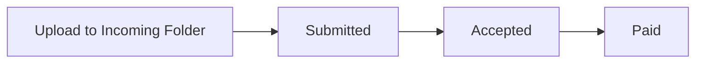

# Finance Tracker Authentication - Quick Start Guide

## TL;DR

The Finance Tracker now has user authentication! Run `setup_auth.py` to get started in minutes.

## Environment Prep (Once Per Machine)

1. **Create the virtual environment**  
   - macOS/Linux: `./scripts/setup_venv.sh`  
   - Windows PowerShell: `pwsh -File scripts/setup_venv.ps1`
2. **Copy the secrets template**: `cp .env.example .env` (then edit values)
3. **Copy the config templates**:  
   `cp config/quick_links.example.json config/quick_links.json`  
   `cp config/qb_directions.example.json config/qb_directions.json`
4. Fill in `.env` plus both config files with your Google Drive IDs, URLs, and direction buckets.

## Quick Setup (3 Minutes)

```bash
# 1. Install dependencies
cd finance_tracker
source .venv/bin/activate  # or . .venv/bin/activate on fish-compatible shells
pip install -r requirements.txt  # skip if you ran scripts/setup_venv.*

# 2. Run setup script
python setup_auth.py

# 3. Launch the app
python dash_app.py

# 4. Open browser
# http://localhost:8051
```

> Tip: Use `deactivate` when you are done working in the virtual environment.

## What Changed?

### Before (Old System)
- ❌ Single shared password for everyone
- ❌ No user tracking
- ❌ No password management
- ❌ Everyone had same access

### After (New System)
- ✅ Individual user accounts
- ✅ Secure password hashing
- ✅ Session management
- ✅ User profile viewing
- ✅ Password change capability
- ✅ Admin user management dashboard
- ✅ Account activation controls

## Features at a Glance

### For Users
- **Register**: Create your own account
- **Login**: Secure authentication with sessions
- **Profile**: View your account details
- **Change Password**: Update your password anytime
- **Session**: Stays logged in for 24 hours

### For Admins
- **User Management**: View all users
- **Enable/Disable**: Control account access
- **Password Reset**: Reset user passwords
- **Statistics**: Monitor user activity

## File Structure

```
finance_tracker/
├── dash_app.py              # Main dashboard (port 8051)
├── finance_db.py            # Database + auth functions
├── auth_callbacks.py        # Authentication UI callbacks
├── admin_dashboard.py       # Admin interface (port 8052)
├── setup_auth.py           # Setup script
├── requirements.txt         # Python dependencies
├── finance_tracker.db       # SQLite database (auto-created)
├── .env                     # Environment variables
├── AUTH.md                  # Complete documentation
├── config/
│   ├── quick_links.example.json   # Safe-to-commit template
│   ├── qb_directions.example.json # Template for Sankey groupings
│   └── *.json                     # Real configs copied from the templates (.gitignored)
└── scripts/
   ├── setup_venv.sh        # POSIX virtualenv helper
   └── setup_venv.ps1       # Windows virtualenv helper
```

## Common Tasks

### Create New User (Normal User)
1. Open http://localhost:8051
2. Go to Quick Links tab
3. Click "Register"
4. Fill in details, create account
5. Login with new credentials

### Create Admin User (via Python)
```python
import finance_db

finance_db.create_user(
    username='admin2',
    email='admin2@example.com',
    password='secure123',
    is_admin=True
)
```

### Change Your Password
1. Login to Quick Links tab
2. Click "🔄 Change Password"
3. Enter current and new password
4. Submit

### Manage Users (Admin)
```bash
# Start admin dashboard
python admin_dashboard.py

# Open browser
# http://localhost:8052
```

### Check User List (Python)
```python
import finance_db

users = finance_db.list_all_users()
for user in users:
    print(f"{user['id']}: {user['username']} - Active: {user['is_active']}")
```

## Security Notes

- **Passwords**: Hashed with PBKDF2-SHA256, never stored in plain text
- **Sessions**: 32-byte random tokens, expire after 24 hours
- **Access Control**: Quick Links tab requires authentication
- **Admin Privileges**: Separate admin dashboard for user management

## Troubleshooting

### "Import Error: No module named 'werkzeug'"
```bash
pip install werkzeug
```

### "Database is locked"
Only one process can write to SQLite at once. Close other instances.

### "Invalid username or password"
- Check spelling
- Verify account is active
- Ensure caps lock is off

### "Session expired"
Sessions last 24 hours. Just login again.

## Environment Variables

Required in `.env` file:

```bash
# Authentication (required)
SECRET_KEY=your-secret-key-here

# Google Sheets
GOOGLE_SHEET_URL=https://docs.google.com/spreadsheets/d/YOUR_ID/edit

# Linkwarden
LINKWARDEN_URL=http://localhost:3000

# Legacy (deprecated)
QUICKLINKS_PASSWORD=finance2025
```

### Google Service Accounts

#### What is a Service Account?

A service account is a special Google account that belongs to your application, not a human user. It lets the Finance Tracker read from and write to Google Drive and Sheets without requiring individual user logins. Think of it as a "robot user" with its own credentials.

**Why use a service account instead of OAuth?**
- No manual login required—the app authenticates automatically on startup
- Works in headless/server environments where browser OAuth flows aren't feasible
- Single credential file shared across the team (stored securely, never committed)
- Simpler architecture for internal tools with trusted users

#### Creating a Service Account

1. **Go to Google Cloud Console**: Open [console.cloud.google.com](https://console.cloud.google.com)
2. **Create or select a project**: Use the dropdown at the top to pick your project (or create a new one)
3. **Enable required APIs**:
   - Navigate to **APIs & Services → Library**
   - Search for and enable:
     - **Google Drive API**
     - **Google Sheets API**
4. **Create the service account**:
   - Go to **IAM & Admin → Service Accounts**
   - Click **Create Service Account**
   - Give it a name (e.g., `finance-tracker-bot`) and optional description
   - Click **Create and Continue**, then **Done** (no roles needed at project level for Drive/Sheets)
5. **Generate a key**:
   - Click on your new service account in the list
   - Go to the **Keys** tab → **Add Key → Create new key**
   - Choose **JSON** format and click **Create**
   - Save the downloaded `.json` file somewhere secure outside your repository (e.g., `~/.ssh/finance-tracker-sa.json`)

#### Configuring the Service Account

In your `.env` file, point to the JSON key:

```bash
GOOGLE_SERVICE_ACCOUNT_JSON=/full/path/to/your-service-account-key.json
```

If you already have `GOOGLE_APPLICATION_CREDENTIALS` exported system-wide, the app will fall back to that, but setting `GOOGLE_SERVICE_ACCOUNT_JSON` explicitly is clearer.

**Security note**: Never commit the JSON key to version control. Only store the *path reference* in `.env`. For production, use a secrets manager (AWS Secrets Manager, Google Secret Manager, etc.) and inject the path at runtime.

## Config Files to Copy

| File | Source | Purpose |
| --- | --- | --- |
| `.env` | `.env.example` | Secrets, URLs, folder IDs |
| `config/quick_links.json` | `config/quick_links.example.json` | Populates Quick Links tab categories |
| `config/qb_directions.json` | `config/qb_directions.example.json` | Maps `inv_from`/`inv_to` values into money-in/out buckets for Sankey views |

Both JSON files are ignored by Git. Update them whenever you add new vendors, clients, or URLs in your Google Sheet.

#### Granting Access to Drive Folders

The service account needs explicit permission to access your Google Drive folders, just like any other user.

1. **Find the service account email**: Open your JSON key file and look for the `client_email` field. It will look like:
   ```
   finance-tracker-bot@your-project.iam.gserviceaccount.com
   ```
2. **Share folders with the service account**:
   - Open the **Incoming** folder in Google Drive (the one specified by `INVOICE_INCOMING_FOLDER_ID`)
   - Click **Share** → Add the service account email
   - Grant **Editor** permissions (so it can upload files and read metadata)
   - Repeat for the **Processed Root** folder (`INVOICE_PROCESSED_ROOT_FOLDER_ID`)
   - Repeat for any Google Sheets the app needs to write to (e.g., the sheet referenced by `GOOGLE_SHEET_URL`)

Without this sharing step, you'll see `404 File not found` errors when the app tries to upload or list invoices.

**Pro tip**: If your folders are in a Shared Drive (Team Drive), ensure:
- The service account is added as a member of the Shared Drive itself (not just the folders)
- API calls include `supportsAllDrives=True` (already handled in `app.py`)

### Invoice Drive Folders

- `INVOICE_INCOMING_FOLDER_ID` must be the Google Drive folder where new uploads land. Every file you drop into the Invoice tab is stored here first with status “submitted.”
- `INVOICE_PROCESSED_ROOT_FOLDER_ID` should point to the parent folder that holds all of your processed/accepted subfolders (e.g., one per client, per month, etc.). The dropdown inside each invoice card is populated from the subfolders beneath this root.
- When you click “Move & Log,” the file is moved out of the incoming folder and into the selected processed subfolder, then appended to the Google Sheet. “Mark Paid” updates the file’s custom appProperties to `paid` while leaving it in its processed folder.

Invoice status flow:



### Understanding Invoice Metadata & State

The Finance Tracker stores invoice state in **Google Drive file metadata**, not in your Google Sheet or local database. This is why invoice cards remember their status across app restarts even when Sheet logging fails.

#### What Gets Stored in Drive

Each invoice file carries two critical pieces of metadata managed by the Drive API:

1. **appProperties** - Custom key-value pairs attached to the file:
   ```python
   "appProperties": {"status": "submitted"}  # or "accepted", "paid"
   ```
   - Set automatically when you upload a file
   - Updated when you click "Move & Log" (→ "accepted") or "Mark Paid" (→ "paid")
   - Updated when you use the "Manual Override" controls
   - **Not visible** in the Google Drive UI; only accessible via API

2. **parents** - The folder ID(s) where the file lives:
   ```python
   "parents": ["1ZWgOIAsO7l3DeOB3BodM7ofs0g4wM6yU"]  # Incoming folder
   ```
   - Visible as the file's location in Drive's folder tree
   - Changed when "Move & Log" moves the file to a processed subfolder

#### Where It's Stored

All metadata lives on **Google's servers**—nothing is cached locally. When the app loads the invoice list:
1. It queries the Drive API to list files in your Incoming and Processed folders
2. Reads each file's `appProperties.status` to determine badge color
3. Builds invoice cards from this fresh Drive metadata

The **Google Sheet** (`inv_tbl`) is purely an audit log—it doesn't control what you see in the dashboard.

#### Fixing Incorrect Status

The Finance Tracker dashboard now includes **Manual Override** controls on each invoice card:

1. **View current status**: Look for "Current: Submitted/Accepted/Paid" below the progress tracker
2. **Change status manually**:
   - Use the "Manual Override" dropdown at the bottom of the card's action panel
   - Select the correct status (Submitted, Accepted, or Paid)
   - Click "Update Status"
   - The file's `appProperties.status` is updated immediately via the Drive API
   - The card refreshes to show the new status

**Common use cases for manual overrides:**
- Reset a file back to "submitted" after testing "Move & Log"
- Mark a file "paid" without moving it to a processed folder first
- Fix status discrepancies caused by API errors or manual Drive folder moves
- Bulk-correct files that were moved manually outside the app

**Alternative: Direct Drive API manipulation**
If you need to inspect or modify metadata outside the app:
- Use [Google Drive REST API Explorer](https://developers.google.com/drive/api/v3/reference/files/get)
- Call `files.get` with `fileId` and `fields=appProperties` to view
- Call `files.update` to change `appProperties` programmatically

**Why status persists across restarts:**
Since the source of truth is Drive metadata (not a local database or Sheet), any status changes you make are permanent until explicitly updated. Restarting the app simply re-queries the same Drive metadata.

#### Archiving Invoices

The Finance Tracker includes an **Archive** feature to stop tracking invoices without deleting them from Google Drive.

**How it works:**
- Click the "🗑️ Archive" button on any invoice card
- The app sets `appProperties.archived = "true"` on the file
- The invoice **disappears from the dashboard** but **remains in Drive**
- The file is **not moved to trash**—it stays in its current folder
- Archived files are filtered out when building invoice cards

**Use cases for archiving:**
- **Duplicates**: Stop tracking duplicate uploads without deleting the file
- **Errors**: Remove incorrectly uploaded files from the workflow
- **Test files**: Clean up demo/test invoices after development
- **Completed work**: Hide old invoices that are fully processed and don't need ongoing tracking

**Viewing archived files:**
Archived files remain in their Drive folders with normal visibility. You can:
- Open the folder in Google Drive web interface
- Search by filename to find archived invoices
- Check the file's `appProperties` via Drive API to see `archived: "true"`

**Un-archiving files:**
To bring an archived invoice back into the dashboard:
1. Use Google Drive REST API Explorer or a script:
   ```python
   service.files().update(
       fileId="YOUR_FILE_ID",
       body={"appProperties": {"archived": "false"}},
       supportsAllDrives=True
   ).execute()
   ```
2. Or simply **remove the archived property** entirely:
   ```python
   # Fetch current properties
   file = service.files().get(fileId="YOUR_FILE_ID", fields="appProperties", supportsAllDrives=True).execute()
   props = file.get("appProperties", {})
   
   # Remove archived key
   if "archived" in props:
       del props["archived"]
   
   # Update file
   service.files().update(
       fileId="YOUR_FILE_ID",
       body={"appProperties": props},
       supportsAllDrives=True
   ).execute()
   ```
3. The file will reappear in the dashboard on the next refresh

**Difference from trash:**
- **Archive**: File stays in place, metadata marks it as `archived=true`, hidden from dashboard only
- **Trash** (manual Drive deletion): File moved to Drive trash, recoverable for 30 days before permanent deletion

Generate a secret key:
```python
import os
print(os.urandom(24).hex())
```

## API Quick Reference

```python
import finance_db

# Create user
success, msg, user_id = finance_db.create_user('john', 'john@example.com', 'pass123')

# Authenticate
success, msg, user_dict = finance_db.authenticate_user('john', 'pass123')

# Create session
session_id = finance_db.create_session(user_id)

# Validate session
valid, user_dict = finance_db.validate_session(session_id)

# Change password
success, msg = finance_db.change_password(user_id, 'oldpass', 'newpass')

# List users (admin)
users = finance_db.list_all_users()

# Enable/disable user (admin)
success, msg = finance_db.toggle_user_status(user_id, is_active=True)

# Reset password (admin)
success, msg = finance_db.admin_reset_password(user_id, 'newpass')
```

## Migration from Old System

### Users with Old Password
1. Tell them to register a new account
2. Delete old QUICKLINKS_PASSWORD from .env (after migration)
3. Legacy password callback will suggest registration

### Data Migration
No data migration needed! The new system:
- Keeps all existing Google Sheets connections
- Maintains Quick Links configuration
- Preserves historical financial data
- Adds user authentication on top

## Next Steps

1. ✅ Run `setup_auth.py` 
2. ✅ Create admin user
3. ✅ Test login/registration
4. ✅ Create accounts for team members
5. ✅ Remove legacy QUICKLINKS_PASSWORD
6. ✅ Read AUTH.md for advanced features

## Need Help?

- **Full Documentation**: See `AUTH.md`
- **General Info**: See `README.md`
- **Control Panel**: See `control_panel/README.md`
- **Code Issues**: Check error messages and logs

## Alternative Authentication Options

The current system uses custom SQLite authentication. For alternatives:

- **OAuth 2.0**: Social login (Google, Microsoft)
- **LDAP**: Enterprise directory integration
- **JWT**: Stateless token authentication
- **Flask-Login**: Industry-standard Flask extension
- **Dash-Auth**: Built-in Dash authentication

See `AUTH.md` section "Alternative Authentication Strategies" for details.

## Credits

Built with:
- Dash - Web framework
- Flask - HTTP server  
- werkzeug - Password hashing
- SQLite - Database
- secrets - Token generation

Part of the Finance Tracker project by Austin Capital Data.
